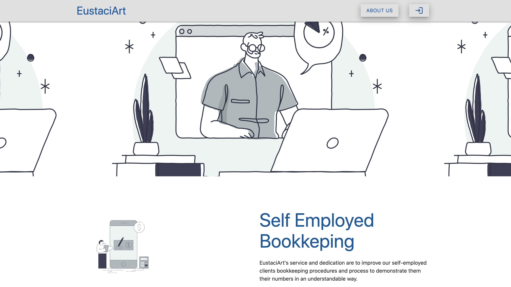
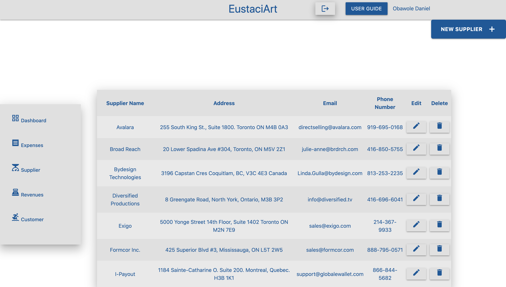
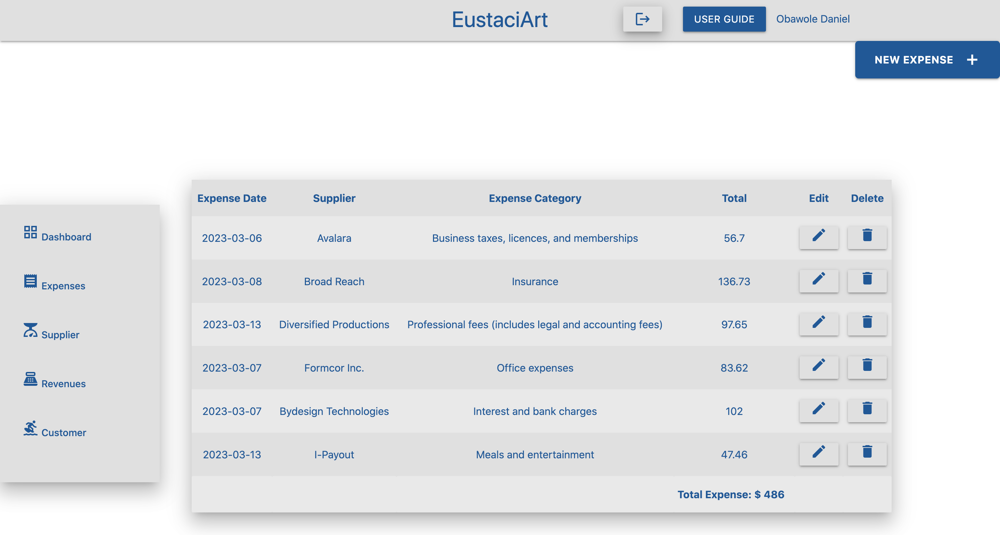
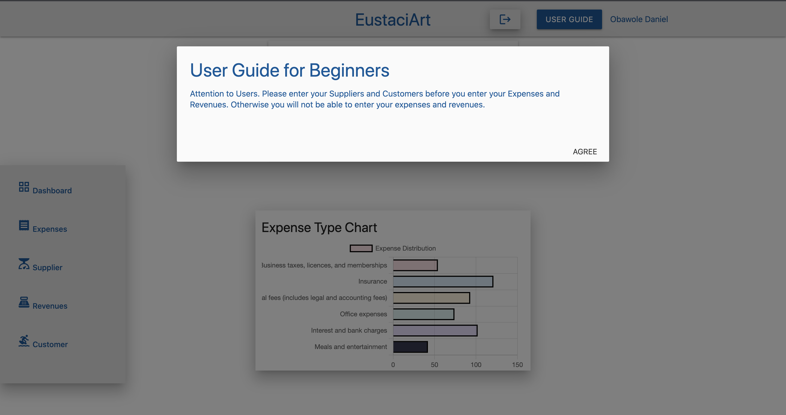

# Eustacia

Details for Eustacia Bookkeeping App

Eustacia is a self-employed bookkeeping web app with the scope of storing and managing individual and corporate records.

There are several deployed web app examples that perform functionalityies of self-employed bookkeeping procedure. However, Eustacia has a competitive edge over existing platforms.

The functionalities include creating your supplier as a user, manage expenses, send an email to your supplier to notify regarding the recorded invoices and read a quote from out top notch personnel.

# SCREENSHOT

# Tech Stack

- HTML
- JavaScript
- CSS
- Materialize CSS
- Node.js
- Express
- JQuery
- MongoDB
- OAuth 2.0
- API for Quotes
- Chart.js
- Heroku

# Deployment

<a href="" target="_blank">Eustacia</a>

# Future Improvements

- Manage charts effectively for each corresponding supplier.
- Manage reports by each user and compare to previous expenses.
- Implement email functionality for user's record.

# Images
- DesignStripe

